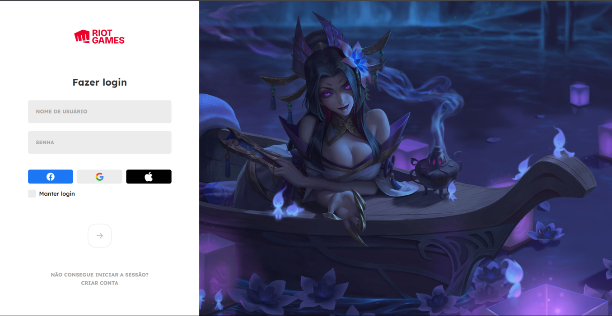

<h1 align="center"> 
    League of legends - Login Screen 
</h1>

  <a href="#-tecnologias">Tecnologias</a>&nbsp;&nbsp;&nbsp;|&nbsp;&nbsp;&nbsp;
  <a href="#-projeto">Projeto</a>&nbsp;&nbsp;&nbsp;|&nbsp;&nbsp;&nbsp;

 

  

 

## 🚀 Tecnologias
Esse projeto foi desenvolvido com as seguintes tecnologias:
- Javascript
- HTML5
- CSS

## 💻 Projeto
Clone da tela de login do League of Legends 100% responsivo com as animações de input e disabled button e checkbox.